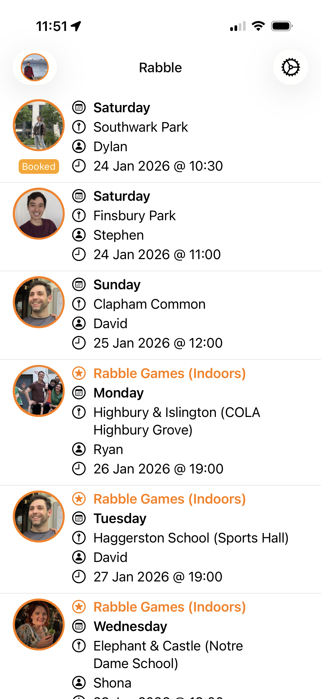
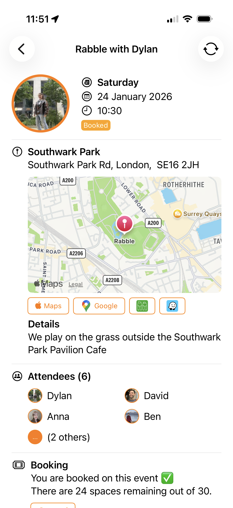

# Rabble

A native iOS app for discovering and booking local Rabble sessions (fitness classes) using the [MakeSweat](https://makesweat.com) platform.

## Features

- Browse upcoming events in your area
- View event details including venue, time, and attendees
- Book events using your passes
- Multi-account support
- Integrated maps for navigation to venues

## Screenshots

| Event List | Event Details |
|------------|---------------|
|  |  |

## Requirements

- iOS 17.0+
- Xcode 15+

## Dependencies

- [Nuke](https://github.com/kean/Nuke) - Image loading and caching
- [Time](https://github.com/davedelong/time) - Date and time handling
